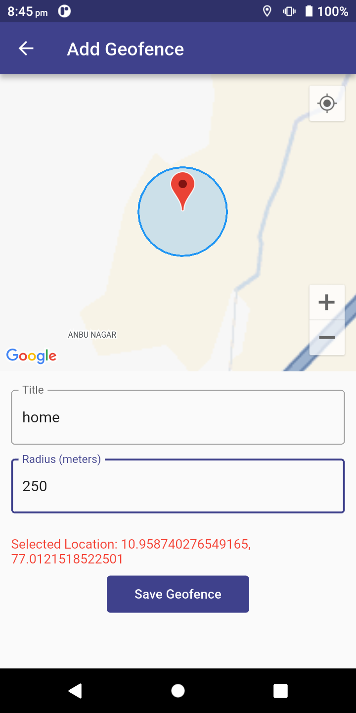
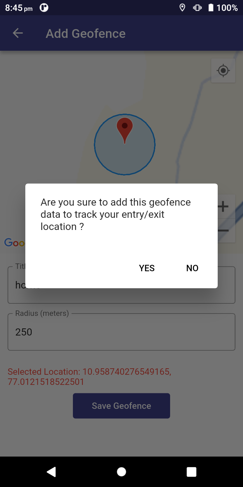
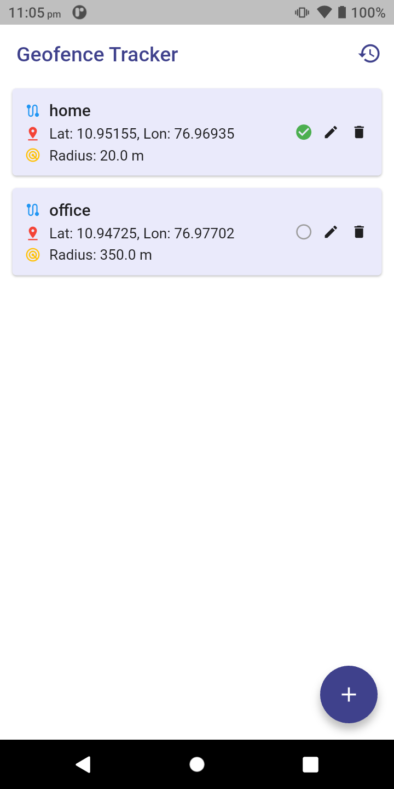
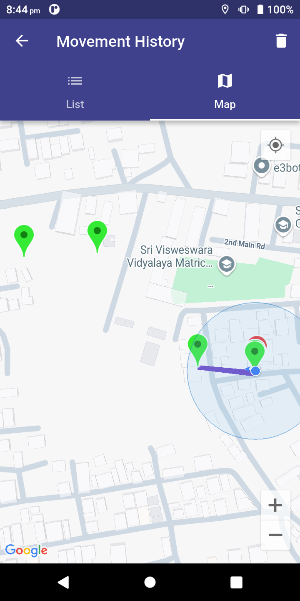
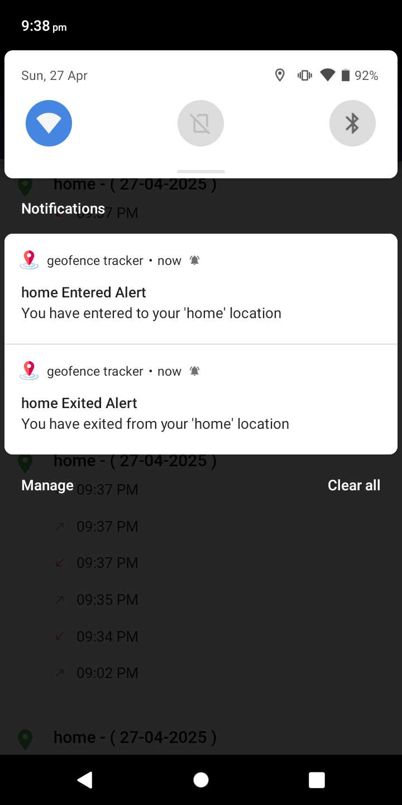

# Geofence Tracker App

The Geofence Tracker App is a sophisticated Flutter application engineered for smart, power-efficient location tracking and comprehensive geofence management. It offers real-time detection of geofence entry and exit events, a detailed user movement history, and intelligent location management based on motion and activity.

**Core Features**

*   **Geofence Monitoring and Management:**
    *   Define multiple geofences (virtual boundaries).
    *   Receive real-time notifications when a user enters or exits a geofence.
    *   Geofence information is saved locally.
*   **Intelligent Background Location Tracking:**
    *   Uses the `geolocator` plugin for accurate location data.
    *   Maintains tracking even when the app is running in the background or is closed.
    *   Optimizes battery usage by intelligently managing location tracking.
*   **Location History with Geofence Association:**
    *   Maintains a complete history of the user's location.
    *   Records timestamps and location coordinates.
    *   Associates location points with the geofences the user was in.
    *   History information is saved locally.
*   **Map Visualization:**
    *   Integrates with Google Maps to plot the user's movement history.
    *   Displays markers at each recorded location point.
    *   Draws lines between location points to show the user's path.
    *   Uses different colors for the lines to indicate which geofence the user was in (or if they were outside any geofence).
* **Local Storage**: Geofence and history information are stored locally using `shared_preferences`.
* **Notification**: Provides notification when the user enter or exit the geofence.

**Technologies Used**

*   **Flutter:** The cross-platform UI framework.
*   **`geolocator`:** For accurate location tracking.
*   **`google_maps_flutter`:** For map visualization.
*   **`flutter_local_notifications`:** For geofence entry/exit notifications.
*   **`flutter_background_geolocation`**: For background location tracking.
*   **`shared_preferences`**: For local storage.

**Getting Started**

## Getting Started

This section will guide you through setting up and running the Geofence Tracker App on your local development environment.

### Prerequisites

Before you begin, ensure you have the following installed:

*   **Flutter SDK:**
    *   You need to have the Flutter SDK installed. If not, follow the official installation guide: [https://docs.flutter.dev/get-started/install](https://docs.flutter.dev/get-started/install)
*   **Android Studio or VS Code:**
    *   Install either Android Studio or VS Code with the Flutter and Dart plugins for development.
    *   [https://developer.android.com/studio](https://developer.android.com/studio)
    *   [https://code.visualstudio.com/](https://code.visualstudio.com/)
*   **Android SDK:**
    *   If you're using Android Studio, make sure you have the Android SDK installed and set up.
*   **iOS**
*   Follow the iOS section in the Flutter documentation.
*   **Git:**
    *   You'll need Git to clone the repository. [https://git-scm.com/book/en/v2/Getting-Started-Installing-Git](https://git-scm.com/book/en/v2/Getting-Started-Installing-Git)
*   **Emulator or Physical Device:**
    *   You will need an Android or iOS emulator or a physical device to run the app.

### Installation

1.  **Clone the Repository:**

    *   Open your terminal and navigate to the directory where you want to store the project.
    *   Run the following command to clone the repository:
    *   Replace `[your repository url]` with the actual URL of your project's repository.
2.  **Navigate to the Project Directory:**
3.  **Install Dependencies:**

    *   Run the following command to install the required Flutter packages:
### Configuration

1.  **Google Maps API Key:**

    *   This app uses Google Maps, so you need a Google Maps API key.
    *   Go to the Google Cloud Console: [https://console.cloud.google.com/](https://console.cloud.google.com/)
    *   Create or select a project.
    *   Enable the "Maps SDK for Android" and "Maps SDK for iOS" APIs.
    *   Create API credentials.
    *   Get your API key.
    *   **Android:**
        *   Open `android/app/src/main/AndroidManifest.xml`.
        *   Add the following within the `<application>` tag (replace `YOUR_GOOGLE_MAPS_API_KEY` with your actual key):
    * **iOS:**
    * Open `ios/Runner/AppDelegate.swift`.
    * Add the following below the import:
    *   Replace `YOUR_GOOGLE_MAPS_API_KEY` with your actual key.
2. **iOS permission**:
    * If you are building for iOS, remember to add the location keys to `Info.plist`
3.  **Permissions (Android)**
    *   Ensure that you have all the location permissions declared in `android/app/src/main/AndroidManifest.xml`.
        <manifest xmlns:android="http://schemas.android.com/apk/res/android"> <uses-permission android:name="android.permission.ACCESS_FINE_LOCATION" /> </manifest>
### Running the App

1.  **Connect Device or Start Emulator:**

    *   Connect your physical device (Android or iOS) or start an emulator.
2.  **Run the App:**

    *   In your terminal (inside the project directory) or in Android Studio/VS Code, run:
3.  **App Launch:**

    *   The app will now launch on your device or emulator.

### Testing

1.  **Add Geofences:**

    *   In the app, go to the "Geofences" section and add some geofences using the provided UI.
2.  **Start Location Tracking:**
* Open App and place the device in specified geolocation.
3.  **Test Geofence Entry/Exit:**
    *   Move around (or simulate movement) to enter and exit the defined geofence regions to test if notifications are working.

4.  **History**:
    * Check the history section if the geofence events are stored properly.
5.  **Map Visualization:**

    *   Go to the "History" section, and then to the "Map" tab, to check if the history is being properly displayed on the map with lines and markers.

### Troubleshooting

*   **API Key Issues:** If you get map-related errors, double-check that you've added your Google Maps API key to the `AndroidManifest.xml` file.
*   **Dependency Issues:** If you get errors about missing dependencies, re-run `flutter pub get` and then clean and rebuild your project (`flutter clean`, and then rebuild).
* **Permissions**: If the location or notification is not working, make sure to request permission from the user.
*   **Emulator Location:** If you're using an emulator, make sure the emulator's location settings are turned on.

## App Screenshots

### Geofence Management

_Figure 1: Adding a new geofence._

### Home View

_Figure 2: Home view shows the list of created geofence with data and status._

### Map Visualization

_Figure 3: Location history displayed on the map._

### Geofence Notification

_Figure 4: Example of geofence notification._
